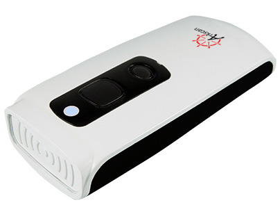

# 200 - Requirements

- [AS10 Bluetooth NFC Reader](https://www.arkscan.com/product/barcode-scanner/nfc-uhf-rfid-reader/as10-rfid-nfc-reader) ($329.00) from Arkscan, LLC (www.arkscan.com)

**NOTE**: The AS10 Bluetooth NFC Reader is fully compliant with ISO-14443A, ISO-14443B, ISO-15693, and NFC standards. 

|Standard|RFID Chips|
|--|--|
|ISO14443A|Mifare 1 S-70, Mifare 1 S-50, Mifare Ultralight, Mifare DesFire (MF3), SLE44R35S|
|ISO14443B|SRIX512, SRIX4K|
|ISO-15693|I-Code SLI (SL1 ICS30 01), Ti2048 (Tag HF-I), Ti256 (Tag), my-d SRF55V02P, Advant ATC1024-MV110|
|NFC|Topaz, Felica, NTag|
